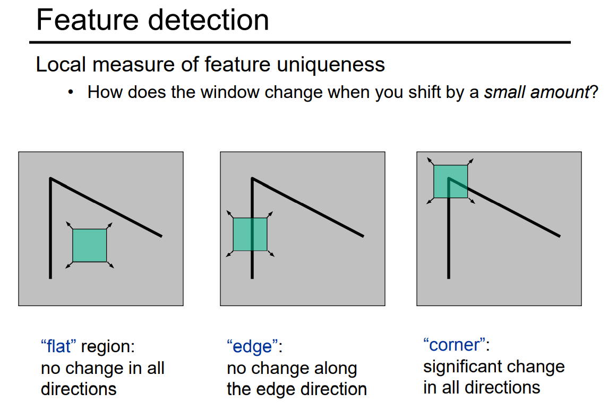

# Feature Detection

### Choosing the parameter

* Initial number of points s
* Distance threashold t
* Number of samples N
* Consensus set size d

### Adaptiveely

### RANSAC pros and cons

* Pros
* simple and general
* Appicable to many different problems
* Often works well in practice

### Harris Features

## Feature Detection
